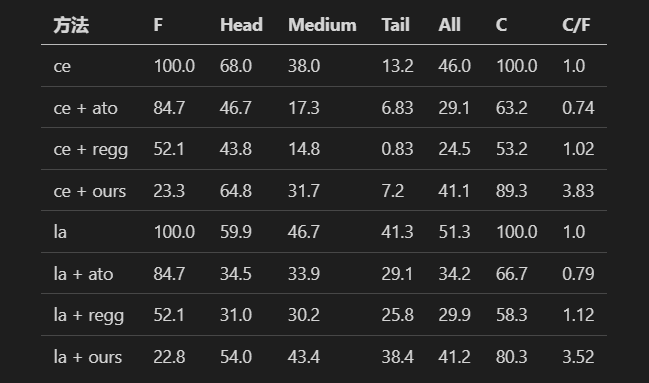
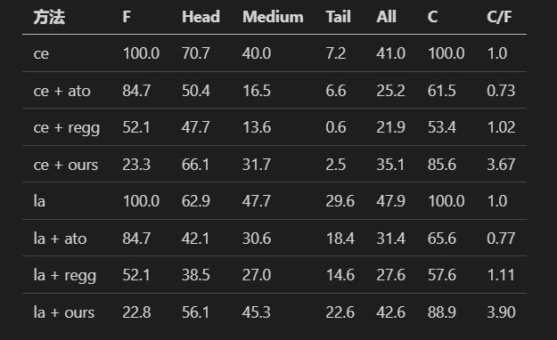

# evn - demo

```
conda create -n LTAP 3.8.11   
source activate LTAP 
pip install -r requirements.txt
python main.py --save_all_epoch --hesso --target_group_sparsity 0.1 --isc LT-vote --imb_ratio 100  --bs --gpu 1 > bs_1.log  2>&1 &
```

All the command templates have been placed in ``1.sh``; you can run it directly or execute individual commands from it.

# Additional 
### Ablation Study Analysis on CIFAR-100-LT (ir=100)
We conduct an ablation study analysis on the CIFAR-100-LT dataset with an imbalance ratio (ir) of 100. Specifically, "Base" refers to the baseline method for long-tailed tasks, while "ours w.o. PSL" denotes the scenario where $\alpha_k \equiv 1$. 


### Pseudocode


### ir =50

### ir = 100


